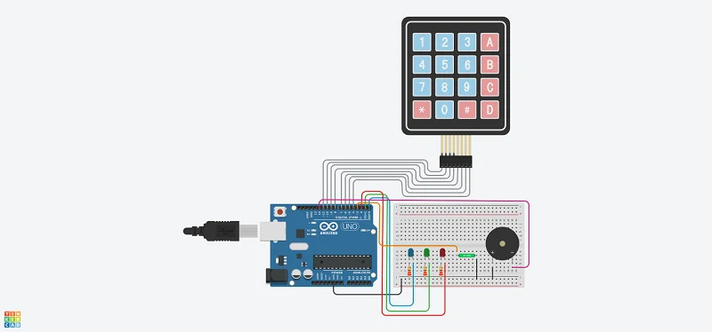
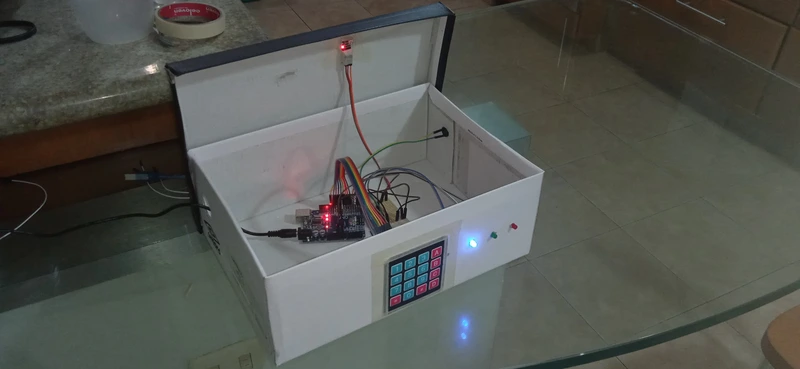
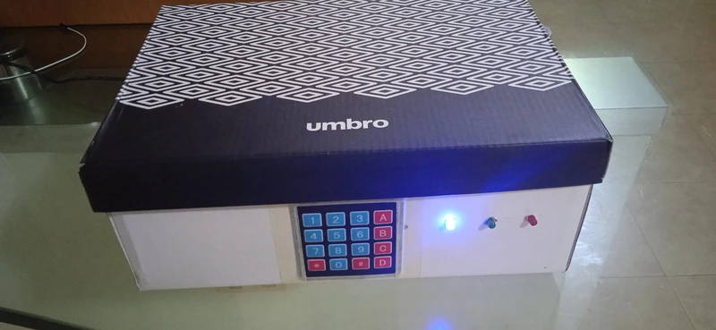

[Ingles](https://github.com/vegamc04/safe/blob/master/README.md)

[Portugues](https://github.com/vegamc04/safe/blob/master/readme_config/versions/readme_pt.md)

# Caja fuerte

Proyecto desarrollado con [Arduino](https://www.arduino.cc/)

## Componentes utilizados

- Arduino UNO R3
- Contenedor (tamaño de preferencia)
- Placa de pruebas (tamaño de preferencia)
- Resistores 220 Ω - Cantidad: **3**
- KY-017 (sensor de inclinacion de mercurio)
- Buzzer activo
- Led - Cantidad: **3**
- Teclado matricial 4x4
- Cable dupont hembra-macho - Cantidad: **11**
- Cable dupont macho-macho - Cantidad: **10**
- Cable de USB A a USB B cable (para Arduino)

## Instrucciones de inicializacion

1. Instala la libreria "Arduino AVR Boards" de Arduino en tu entorno de desarrollo preferido (se recomienda Arduino IDE) a traves del Administrador de Placas.

2. Navega al archivo [arduino.ino](./arduino.ino) y conecta tu Arduino Uno a tu computadora usando el cable usb, sube el codigo y luego resetealo.

## Funcionamiento

|Tecla|Accion|
|:--------|:--------|
|A|Desarmar|
|B|Establecer contraseña y ( Cambiar contraseña )|
|C|[ Rearmar ]|
|D|( Reset )|
**( )** La accion requiere confirmacion de contraseña antes de la ejecucion.
**[ ]** La accion requiere que la caja fuerte este desarmada antes de la ejecucion.

|Led|Estado|Accion|
|:--------|:--------|:------|
|Azul|Encendido|Servicio en funcionamiento|
|Azul|Un parpadeo|Solicitud de cambio de memoria|
|Verde|Un parpadeo|Operacion completada exitosamente|
|Verde|Dos parpadeos|Solicitud de cambio de contraseña aceptada|
|Rojo|Un parpadeo|Operacion fallida|
|Azul + Red|Un parpadeo|Tecla inactiva|

Diagrama general de conexion, proyecto completo en [Tinkercad](https://www.tinkercad.com/things/jaSxoWvyj15-safe)

## Fotografias

Shield: [![CC BY-SA 4.0][cc-by-sa-shield]][cc-by-sa]

This work is licensed under a
[Creative Commons Attribution-ShareAlike 4.0 International License][cc-by-sa].

[![CC BY-SA 4.0][cc-by-sa-image]][cc-by-sa]

[cc-by-sa]: http://creativecommons.org/licenses/by-sa/4.0/
[cc-by-sa-image]: https://licensebuttons.net/l/by-sa/4.0/88x31.png
[cc-by-sa-shield]: https://img.shields.io/badge/License-CC%20BY--SA%204.0-lightgrey.svg
